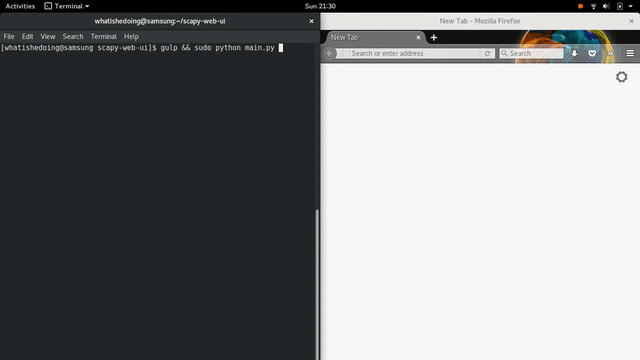
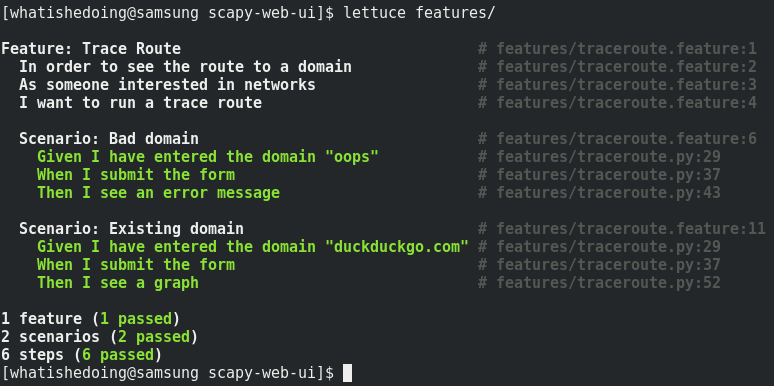

# Scapy Web UI

## Introduction
This is a simple Python web interface -- powered by [Flask][flask] -- that calls functions from the [Scapy][scapy] framework.

[Gulp][gulp] is also used to compile [CoffeeScript][coffeescript] to the custom JavaScript used by the app. CoffeeScript was chosen due to its similarity with Python.

## Setup
**Note**: Scapy has a _lot_ of optional dependencies, so take a look through `setup.sh` before running it!

Most of the dependencies can be installed using the setup script: `sudo sh setup.sh`. The code was originally developed on [Fedora][fedora] 25 x64, with Python 2.7 and g++ pre-installed, although the commands should be adaptable to other environments.

## Run
Open a terminal and run `gulp && sudo python main.py`. You will likely need the `sudo` due to file and network I/O.

## Test

Whilst the web app is running, open a separate terminal and run the integration test suite with `lettuce features/`. This uses [Gherkin][gherkin] feature files that hook into Python [Lettuce][lettuce] scripts, which automate browser testing via [Selenium][selenium]. You should see a test output like this:

## Develop
Use the `gulp watch` command to compile CoffeeScript changes on save. All Gulp commands can be listed using `gulp help`.

If you make changes to the source code whilst running the app, you may need to cancel it and re-run. You may also need to clear your browser cache to see JavaScript changes; you can do this in Chromium by checking the _Disable cache_ option in the _Network_ tab of Developer Tools.

[coffeescript]: http://coffeescript.org/
[fedora]: https://getfedora.org/
[flask]: http://flask.pocoo.org/ "Welcome | Flask (A Python Microframework)"
[gherkin]: https://cucumber.io/docs/reference#gherkin "Reference - Cucumber"
[lettuce]: http://lettuce.it/
[gulp]: https://gulpjs.com/ "gulp.js"
[scapy]: http://secdev.org/projects/scapy/
[selenium]: http://selenium-python.readthedocs.io/ "Selenium with Python"
